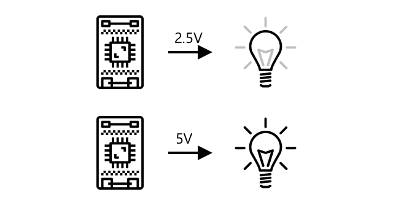
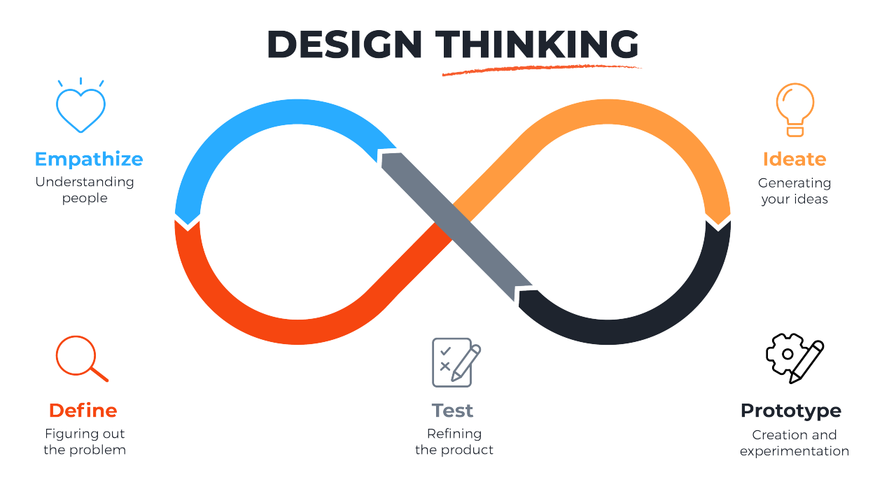
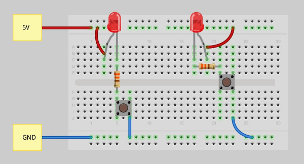
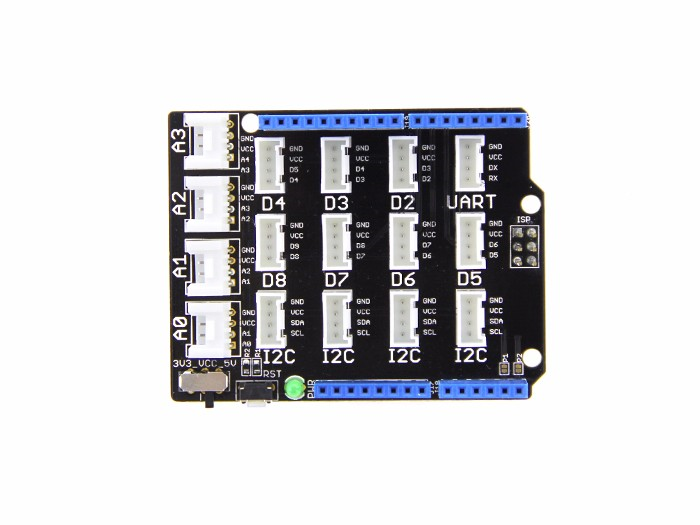

# The truth about "perception"

## Objectives

>* Review the basic components of an IoT system.
>* Explore the basic components that make up the concept of a thing.
>* Perform initial tests with the ESP32 development board.
>* Research the development systems available in the lab.

## Basic components of the Things

Within the context of the Internet of Things (IoT), a "thing" refers to any physical device that is connected to the network and can interact with other devices, systems, or services.

The main components of a thing, from a hardware perspective, can be summarized as follows:
1. Transducers (Sensors and actuators)
2. Microcontrollers/Microprocessors
3. Connectivity modules

Let's discuss these in a little more detail.

# Sensors and Actuators

Transducers are the elements of the thing that allow the IoT device to interact with the environment. They are the equivalent of the senses in living beings and peripherals in computers.

For example, the following figure shows the block diagram of an electronic system that can trigger an alarm when the measured temperature exceeds a certain value.

Each of these will be discussed in greater detail below.

### Sensors

A sensor is a type of transducer whose function is to transform environmental signals (physical signals) into electrical signals, which are the inputs to the system. The following table classifies and summarizes some of the main types of sensors:

There are several classifications for sensors depending on different criteria, such as the type of environmental signal sensed and the type of electrical signal, among others. Some of these are discussed below.

#### **Types of Sensors according to the environmental signal sensed**

Sensors can measure many things, from natural properties such as air temperature to physical interactions such as movement. Some existing sensor types are:

* **Temperature sensors**: These can measure the temperature of the air or the medium in which they are immersed. They are sometimes combined with humidity and pressure sensors in a single module.
  
  

* **Push buttons**: They allow you to sense when they are pressed.
  
  
  
* **Light sensors**: These detect light levels. They also measure different types of light (specific colors, ultraviolet, infrared, or visible light in general).
  
  

* **Accelerometers**: These allow you to measure movement in multiple directions.
  
  

* **Microphones**: These allow you to detect sounds.
  
  

#### **Analog sensors**

These are the most basic type of sensors available. These sensors are supplied with voltage (supply voltage) from the IoT device and return (using an **ADC**) a voltage to the device for reading, the variation of which depends on the measured variable.

   

Below are some examples of this type of sensors:

  

**Can you indentify the variable sensed by any of them?**

#### **Digital Sensors**

Digital sensors detect voltage changes that can only take two possible values (**high** and **low**). The simplest type of this sensor is a **button** or **switch**, which is a sensor with two states: **ON** and **OFF**.
  
   

  Some examples of this type of sensors are shown below:

  

**Can you indentify the variable sensed by any of them?**

  There are more advanced digital sensors that can sense analog variables thanks to their hardware to process the signal obtained, allowing them to be connected directly to the IoT device. A typical example of this is temperature sensors, which are integrated with an ADC. The analog values obtained are converted into digital signals that are sent to the IoT device as serial data.

  

  The following figure shows some types of these sensors:

  

  In this type of sensor, data transmission is typically done via a serial protocol. The following list highlights some of the most commonly used ones:

  

  Among the most commonly used protocols for IoT are RS-232, I2C, SPI, and OneWire, but we'll discuss these in more detail later.

### **Types of Sensors According to Power Supply**

Sensors can be classified based on their power requirements:
* **Active Sensor**: Requires a power source to operate. Some examples include IMUs, LiDAR (Light Detection and Ranging), and CCDs.
* **Passive Sensor**: Does not require power to operate. Some examples include RFID tags, thermistors, and temperature-dependent resistors.

> **To learn more**  
> To learn more about sensor terminology, see the following material on sensors ([link](https://udea-iot.github.io/UdeA_IoT-page/docs/sensores-actuadores/sensores/intro)) available in the lecture notes.

## Actuators

Actuators perform the opposite task of sensors by converting an electrical signal from the IoT device into an environmental signal intended to interact with the physical world. Some common actuators include:
* **LEDs**: These emit light when turned on.
  
  

* **Speaker**: This element emits sound based on the signal it receives, from a basic buzzer to an audio speaker it can be used to play music.

  

* **Motor**: This converts an electrical signal into a defined rotation.
  
  

* **Relay**: These are switches that can be turned on or off by an electrical signal. These allow small voltages from IoT devices to handle high voltages.
  
  

* **Screens or displays**: These are one of the most complete actuators and display information on a screen. Displays can range from simple LED displays to high-resolution video monitors.
  
  

**Types of actuators according to the electrical signal**

As with sensors, the type of electrical signal leads to their classification as:
* **Analog actuators**: Analog actuators take an analog signal and convert it into some kind of interaction based on changes in the applied voltage.
  
  

  It's important to note that, like sensors, today's IoT devices work with digital signals, not analog ones. Therefore, to send an analog signal, the IoT device needs an analog-to-digital converter (ADC), which can be integrated into the IoT device or adapted to an external board that connects to it. The ADC will convert the 0s and 1s from the IoT device to an analog voltage that the actuator can use.

* **PWM modulation actuators**: Unlike the use of **ADCs**, another way of converting digital signals to analog signals is through **PWM modulation** which involves sending a train of pulses, the channels act as if they were an analog signal whose amplitude depends on the width of the pulses in the train. A typical example of the use of PWM is the control of the speed of a motor. In this case, the greater the width of the square wave pulse, the higher the speed of the motor.
  
  

  The following figure shows some cases:

  

* **Digital Actuators**: Similar to digital sensors, digital actuators have two states that are controlled by a **high** and a **low** voltage or have an ADC that allows them to convert an analog signal into a digital one.
  
  

  As with sensors, more advanced digital actuators may involve serial communication protocols for connection to the electronic system. 

  

## Connectivity modules

These allow the IoT device to connect to the network and communicate with other devices or cloud services. These modules can include Wi-Fi, Bluetooth, Zigbee, LoRa, and others.

La siguiente tabla resume algunos de los principales módulos de acuerdo a la tecnologia:

| Technology | Connectivity Module | Description |
|---------------------|---------------------------------------------------|--------------------------------------------------|
| **Wi-Fi** | ESP8266 | Inexpensive and widely used Wi-Fi module. |
| | ESP32 | Microcontroller with integrated Wi-Fi and Bluetooth. |
| | CC3200 | Wi-Fi module with an ARM Cortex-M4 processor. |
| **Bluetooth** | HC-05 | Classic Bluetooth module, suitable for serial communication. |
| | HC-06 | Similar to the HC-05, but only acts as a slave. |
| | nRF24L01 | Low-cost wireless communication module, based on 2.4 GHz, with support for Bluetooth Low Energy (BLE). |
| **Zigbee** | XBee Series 2 | Zigbee module for mesh networks, widely used in home automation. |
| | CC2530 | Low-power Zigbee SoC for wireless communications. |
| **LoRa** | RFM95W | LoRa module for long-range, low-power communications. |
| | SX1276 | Low-power, long-range LoRa chip used in IoT. |
| **Cellular (2G, 3G, 4G, 5G)** | SIM800 | GSM/GPRS module for 2G cellular communication. |
| | SIM900 | GSM/GPRS module widely used in IoT projects. |
| | Quectel EC25 | 4G LTE module for high-speed cellular communication. |
| **Sub-GHz (915 MHz, 868 MHz)** | RFM69 | RF module for 433/868/915 MHz communications. |
| | CC1101 | Low-power sub-1 GHz transceiver, ideal for sensor networks. |

## Sensors and actuators available in the laboratory

Sensors and actuators are how things interact with their surroundings. There are numerous starter kits on the market. The following modules are available in the laboratory:
* **Grove - Starter Kit v3** [[link]](https://wiki.seeedstudio.com/Grove_Starter_Kit_v3/)
  
  

  The following table details the list of components included in this kit:

  |#|Module|Type|
  |---|---|---|
  |1|Grove - LCD RGB Backlight|actuator|
  |2|Grove - Relay|actuator|
  |3|Grove - Buzzer|actuator|
  |4|Grove - Sound Sensor|sensor|
  |5|Grove - Touch Sensor|sensor|
  |6|Grove - Rotary Angle Sensor|sensor|
  |7|Grove - Temperature Sensor|sensor|
  |8|Grove - LED|actuator|
  |9|Grove - Light Sensor|sensor|

> **Documentation** 
> For more information, see the documentation **Grove - Starter Kit v3** ([link](https://wiki.seeedstudio.com/Grove_Starter_Kit_v3/))

* **37 Sensor Kit - Elegoo** [[link]](https://www.instructables.com/Arduino-37-in-1-Sensors-Kit-Explained/)
  
  

  The list of items for this kit is described below:

  | No. | Module | Type |
  |-----|----------------------------------------|----------|
  | 1   | DHT11 Temperature and Humidity Module  | sensor   |
  | 2   | DS18B20 Temperature Sensor Module      | sensor   |
  | 3   | Button switch module                   | sensor   |
  | 4   | Tilt Switch module                     | sensor   |
  | 5   | IR Transmitter Module                  | actuator |
  | 6   | IR Receiver Module                     | sensor   |
  | 7   | Seven-Color flash Module               | actuator |
  | 8   | Passive Buzzer                         | actuator |
  | 9   | Active Buzzer                          | actuator |
  | 10  | Laser Module                           | actuator |
  | 11  | RGB LED Module                         | actuator |
  | 12  | SMD RGB LED Module                     | actuator |
  | 13  | Photo Interrupter Module               | sensor   |
  | 14  | Two Color LED Module (5mm)             | actuador |
  | 15  | Light Dependent Resistor Module        | sensor   |
  | 16  | Large Microphone Module                | sensor   |
  | 17  | Small microphone module                | sensor   |
  | 18  | Reed Switch Module                     | sensor   |
  | 19  | Digital temperature sensor module      | sensor   |
  | 20  | Linear Magnetic Hall Sensor            | sensor   |
  | 21  | Flame Sensor Module                    | sensor   |
  | 22  | Touch Sensor                           | sensor   |
  | 23  | Seven Color flash Module               | actuator |
  | 24  | Joystick Module                        | sensor   |
  | 25  | Line Tracking Module                   | sensor   |
  | 26  | Obstacle Avoidance Sensor              | sensor   |
  | 27  | Rotary Encode Module                   | sensor   |
  | 28  | Relay Module                           | actuator |
  | 29  | LCD display                            | actuator |
  | 30  | Ultrasonic Sensor Module               | sensor   |
  | 31  | MPU 6050 Module                        | sensor   |
  | 32  | HC SR501 PIR Sensor                    | sensor   |
  | 33  | Water Level Detection Sensor Module    | sensor   |
  | 34  | DS1307 Serial Real Time Clock          | sensor   |
  | 35  | Keypad Module                          | sensor   |

   

  > **Documentation** 
  > For more information, consult the documentation of the **Elegoo-sensor-kit** ([link](https://github.com/ieee-uh-makers/elegoo-sensor-kit))

* **Ladzo 37 In 1 Sensors Kit For Arduino** [[link]](https://udea-iot.github.io/UdeA_IoT-page/docs/sensores-actuadores/inventario-lab#landzo-37-in-1-sensors-kit-for-arduino)
  
  

  The list of modules is described below:

  | No. | Module | Type |
  |-----|-----------------------------------|----------|
  | 1   | KY-023 Joystick module            | sensor   |
  | 2   | KY-026 Flame Sensor Module        | sensor   |
  | 3   | KY-016 RGB LED Module             | actuator |
  | 4   | KY-027 2PCS Light Cup module      | sensor   |
  | 5   | KY-003 Hall Magnetic Sensor       | sensor   |
  | 6   | KY-019 Relay Module               | actuator |
  | 7   | KY-024 Linear Hall Sensor         | sensor   |
  | 8   | KY-009 SMD RGB LED                | actuator |
  | 9   | KY-034 7 Color Flash LED          | actuator |
  | 10  | KY-017 Mercury Tilt Switch        | sensor   |
  | 11  | KY-001 18B20 Temperature Sensor   | sensor   |
  | 12  | KY-037 Big Sound Sensor           | sensor   |
  | 13  | KY-036 Touch Sensor               | sensor   |
  | 14  | KY-011 Two Color LED              | actuator |
  | 15  | KY-008 Laser Emitter              | sensor   |
  | 16  | KY-020 Ball Switch                | sensor   |
  | 17  | KY-013 Analog Temperature Sensor  | sensor   |
  | 18  | KY-038 Small Sound Sensor         | sensor   |
  | 19  | KY-028 Digital Temperature Sensor | sensor   |
  | 20  | KY-029 Mini Two-color LED         | actuator |
  | 21  | KY-004 Button                     | sensor   |
  | 22  | KY-018 Photoresistor              | sensor   |
  | 23  | KY-005 IR Emitter                 | actuator |
  | 24  | KY-033 Tracking Sensor            | sensor   |
  | 25  | KY-012 Buzzer                     | actuator |
  | 26  | KY-025 Reed Switch                | actuator |
  | 27  | KY-002 Shock Sensor               | sensor   |
  | 28  | KY-015 Temperature and Humidity Sensor | sensor   |
  | 29  | KY-022 IR Receiver                | sensor   |
  | 30  | KY-032 Avoidance Sensor           | sensor   |
  | 31  | KY-006 Passive Buzzer             | actuator |
  | 32  | KY-021 Mini Reed Switch           | sensor   |
  | 33  | KY-040 Rotary Encoder             | sensor   |
  | 34  | KY-035 Analog Hall Sensor         | sensor   |
  | 35  | KY-031 - Tap Module               | sensor   |
  | 36  | KY-010 - Light blocking           | sensor   |

   

  > **Documentation** 
  > Several examples associated with this kit can be found on the page **Arduino | 37 in 1 Sensors Kit Explained** ([link](https://www.instructables.com/Arduino-37-in-1-Sensors-Kit-Explained/))

The following table shows a summary classification of the sensors shown above according to the criteria mentioned in the previous sections:

**Actuators**

| Actuator | 1-Wire | Pure analog | Pure digital | Digital + PWM | I2C |
|--|--|--|--|--|--|
| Active Buzzer |  |  | x |  |  |  |
| Grove - LCD RGB Backlight | |  | | | x |
| Grove - LED | |  | | x | |
| Grove – Buzzer | | x | | | | |
| Grove – Relay | | x | | | | |
| IR Transmitter Module | | | | x | |
| KY-005 IR Emitter | | x | | | |
| KY-006 Passive Buzzer | | x | | | |
| KY-009 SMD RGB LED | | | | x | |
| KY-011 Two Color LED | | | | x | |
| KY-012 Buzzer | | x | | | |
| KY-016 RGB LED Module | | | | x | |
| KY-019 Relay Module | | x | | | |
| KY-025 Reed Switch | | x | | | |
| KY-029 Mini Two-color LED | | | | x | |
| KY-034 7 Color LED Flash | | x | | | |
| Laser Module | | | | x | |
| LCD display | | x | | | |
| Passive Buzzer | | x | | | |
| Relay Module | | x | | | |
| RGB LED Module | | | | x | |
| Seven Color flash Module | | | | x | |
| Seven-Color flash Module | | x | | | |
| SMD RGB LED Module | | | | x | |
| Two Color LED Module (5mm) | | x | | | |

**Sensors**
| Sensors | 1-Wire | Pure analog | Pure digital | I2C |
|--|--|--|--|--|
| Button switch module | | x | | | | |
| DHT11 Temperature and Humidity Module | x | | | x |
| Digital temperature sensor module | x | | | x |
| DS1307 Serial Real Time Clock | | | | | | x | x |
| DS18B20 Temperature Sensor Module | x | | | | | | x |
| Flame Sensor Module | | | | | | x | x |
| Grove - Light Sensor | | x | | | | | x |
| Grove - Rotary Angle Sensor | | x | | | | | x |
| Grove - Sound Sensor | | x | | | | | x |
| Grove - Touch Sensor | | | x | | | | x |
| Grove – Temperature Sensor | | x | | | | | x |
| HC SR501 PIR Sensor | | | x | | | | x |
| IR Receiver Module | | | x | | | | x |
| Joystick Module | | x | | | | | x |
| Keypad Module | | | x | | | | x |
| KY-001 18B20 Temperature Sensor | x | | | | | | x |
| KY-002 Shock Sensor | | | x | | | | x |
| KY-003 Hall Magnetic Sensor | | x | | | | | x |
| KY-004 Button | | | x | | | | x |
| KY-008 Laser Emitter | | | | | x | | x |
| KY-010 - Light blocking | | | x | | | | x |
| KY-013 Analog Temperature Sensor | | x | | | | | x |
| KY-015 Temperature and Humidity Sensor | x | | | | | | x |
| KY-017 Mercury Tilt Switch | | | x | | | | x |
| KY-018 Photoresistor | | x | | | | | x |
| KY-020 Ball Switch | | | x | | | | x |
| KY-021 Mini Reed Switch | | | x | | | | x |
| KY-022 IR Receiver | | | x | | | | x |
| KY-023 Joystick module | | x | | | | | x |
| KY-024 Linear Hall Sensor | | x | | | | | x |
| KY-026 Flame Sensor Module | | | x | | | | x |
| KY-027 2PCS Light Cup module | | | x | | | | x |
| KY-028 Digital Temperature Sensor | x | | | | | | x |
| KY-031 - Tap Module | | | x | | | | x |
| KY-032 Avoidance Sensor | | | x | | | | x |
| KY-033 Tracking Sensor | | | x | | | | x |
| KY-035 Analog Hall Sensor | | x | | | | | x |
| KY-036 Touch Sensor | | | x | | | |

## Basic prototyping

### Steps for carrying out prototyping

A **prototype** is an initial version of the product whose purpose is to provide a tangible and functional representation of the product to identify possible improvements, problems, and obtain user feedback.

In our context, before starting, it is necessary to be clear about the requirements that the electronic system must meet and proceed to determine the components that will be part of the system in question.

Within the scope we will cover, we define some steps, which are described below:

1. **Design the circuit**: This procedure involves designing the schematic (for more in-depth information on this topic, visit the website). [How to Read a Schematic](https://learn.sparkfun.com/tutorials/how-to-read-a-schematic/)) in which the connection of the components is clearly specified. The following figure shows some commonly used symbols:
   
   
   
   While the schematic design is being carried out, the **BOM** is being built. A simple template for our case could be the following:

   |Item #|Quantity|Reference|Description|
   |---|---|---|---|
   |1||||
   |2||||
   |...||||

2. **Assemble the circuit**: From the schematic, proceed to assemble and test the designed circuit by connecting the different components on a breadboard (for more information consult [Breadboards for Beginners](https://learn.adafruit.com/breadboards-for-beginners)).
   
   

   Here, initial functional tests are performed and any necessary corrections are made before moving on to the final version of the product.

   Sometimes the assembly process is reduced by using external modules and expansion cards. ([**section 6**](#6-tarjetas-de-expación-y-módulos)) as shown below:

   

3. **Define the list of components**: Once the above is done, the next step is to make an inventory of the necessary components known as **Bill of Materials (BOM)** ([What is a Bill of Materials (BOM) in PCB Design?](https://www.seeedstudio.com/blog/2019/07/24/what-is-a-bill-of-materials-bom-in-pcb-design/)). The following figure (taken from the following [link](https://www.proto-electronics.com/blog/how-to-create-best-bom-for-pcb)) shows a tipycall BOM:
   
   

4. **Designing the prototype PCB**: Once the design is tested and determined to work according to specifications, the printed circuit board is designed. This can be achieved using PCB design software such as KiCad or Eagle.
   
   

5. **Assemble and test the prototype**: Once you have the above, what you need to do is solder the components to the PCB and show the functional product.
   
   
   
   After this, further improvements can be made through an iterative process to obtain the ideal product.

 

> **To learn more** 
> If you'd like to learn a little more about the prototyping process, we invite you to read these pages:
> 1. **The Essential Guide to Prototyping your Electronic Hardware Product** [[link]](https://www.sparkfun.com/news/3928)
> 2. **The Essential Guide to Prototyping Your New Electronic Hardware Product** [[link]](https://www.elecrow.com/blog/the-essential-guide-to-prototyping-your-new-electronic-hardware-product.html)
> 3. **Ultimate Guide: How to Develop and Prototype a New Electronic Hardware Product in 2024** [[link]](https://predictabledesigns.com/how-to-develop-and-prototype-a-new-product/)
> 4. **7 steps to making a prototype and supercharging your product design** [[link]](https://www.linkedin.com/pulse/7-steps-making-prototype-supercharging-your-product-design-gufhc)

### Simple Example

The following example summarizes the previous procedure, emphasizing the first three steps. Suppose you want to design a circuit that allows you to turn a device on and off using a switch.

1. **Design the circuit**: The schematic is shown below:
   
   

2. **Assembly**: Before assembling the circuit on a breadboard, Wokwi will be used for this:
   
   
   
   It's important to note that the previous figure showed two possible connections for the same circuit. The idea is to highlight that different configurations can exist for the same schematic. Regardless of the configuration, the most important thing is that the components are connected correctly.

   Finally, the physical configuration is completed as shown in the following figure:

   

   Below is the simulated circuit in tinkercad ([link](https://www.tinkercad.com/things/3xGQvJq9Oq1-ejemploprototipo)):

   

   Wokwi simulation ([link](https://wokwi.com/projects/406696186582842369)) also shown below:

   

3. **Define the component list**: Below is the circuit component list:

|Item #|Quantity|Reference|Description|
|---|---|---|---|
|1|1|LED1|Red LED|
|2|1|R1|$330\Omega$ resistor|
|3|1|P1|Pushbutton|

To reinforce the previous procedure, we invite you to complete the following two exercises.

## Expansion boards and modules

The prototyping process using a breadboard depends on the complexity of the circuit and the available components. In the worst case, it can be extremely complex (image taken from **BREADBIN IS AN 8-BIT TTL CPU ON A BREADBOARD, IN A BREAD BIN** ([link](https://hackaday.com/2021/10/05/breadbin-is-an-8-bit-ttl-cpu-on-a-breadboard-in-a-bread-bin/))):

Fortunately, to save work like this, there are **expansion cards** or **shields** which allow you to connect external components and modules without having to use the breadboard. For example, the **Base Shield V2** ([link](https://wiki.seeedstudio.com/Base_Shield_V2/)):

On the other hand, an **external module** consists of one or more hardware components with all the connections and elements necessary to connect the components directly to the ports of a development board or expansion card, without the need for additional hardware. In short, using an external module makes connecting a component practically **plug & play**, eliminating the need for a breadboard and additional wiring. The following figure shows an example where external hardware is used.

In Section 3, some of the **plug & play** modules available in the laboratory were shown. These are characterized as starter modules since the components are not very complex. However, there are more specialized modules such as GPS, transceivers, wireless modules, and higher-precision and higher-power sensors and actuators available.

> **Important**  
Using modules and expansion boards facilitates prototyping and saves labor.

There are many manufacturers of modules and expansion boards; some are listed below:

|Manufacturer|Link|
|---|---|
|Adafruit Industries|	https://www.adafruit.com/|
|SparkFun Electronics|	https://www.sparkfun.com/|
|dfrobot|	https://www.dfrobot.com/|
|Seeeed Studio|	https://www.seeedstudio.com/|
|Elegoo| https://www.elegoo.com/|
|sunfounde|https://www.sunfounder.com/|
|robotistan|https://www.robotistan.com/|
|osoyoo|https://osoyoo.com/|
|thingpulse|https://thingpulse.com/
|keyestudio|https://www.keyestudio.com/|
|Arduino|https://store-usa.arduino.cc/products/|

## About Components

### Manufacturers

The following table shows some of the main companies dedicated to manufacturing modules for IoT prototyping:

|Manufacturer|Link|
|---|---|
|Adafruit Industries|https://www.adafruit.com/|
|SparkFun Electronics|https://www.sparkfun.com/|
|dfrobot|https://www.dfrobot.com/|
|Seeeed Studio|https://www.seeedstudio.com/|
|Elegoo|https://www.elegoo.com/|

In addition to manufacturing, they also document and show demonstrative examples of how to use the components manufactured there.

### Distributors

If you want to buy electronic components, there are distributors for that. The following table shows some of the main component distributors worldwide (taken from the website **2023 Top 50 Electronics Distributors List** ([link](https://www.supplychainconnect.com/rankings-research/article/21264998/2023-top-50-electronics-distributors-list))):

|Distributors|Link||---|---|
|Mouser Electronics|https://www.mouser.com/|
|DigiKey Corporation|https://www.digikey.com/|
|Arrow Electronics|https://www.arrow.com/|
|WPG Holdings|https://www.wpgholdings.com/main/index/en|
|Avnet|https://www.avnet.com/wps/portal/us/|
|Future Electronics|https://www.futureelectronics.com/|

In the Colombian case, the following list (taken from the forum **List of Electronics Suppliers - Colombia** ([link](https://www.forosdeelectronica.com/resources/listado-de-proveedores-de-electr%C3%B3nica-colombia.105/))) contains some of the distributors in Colombia:

|Distributors|Link|
|---|---|
|I + D electrónica|https://didacticaselectronicas.com/|
|Sigma electrónica|https://www.sigmaelectronica.net/|
|Electronilab|https://electronilab.co/|
|Suconel|https://suconel.com/|
|La Red Electronica|https://laredelectronica.com/|

## Resources to go further

Explore the following sites to get an idea of what can be done:
* https://randomnerdtutorials.com/
* https://www.adafruit.com/
* https://www.sparkfun.com/
* https://www.seeedstudio.com/
* https://www.luisllamas.es/
* https://www.hackster.io/
* https://hackaday.com/
* https://projecthub.arduino.cc/
* https://makezine.com/
* https://make.co/
* https://es.ubidots.com/
* https://www.wildernesslabs.co/

## References

* https://randomnerdtutorials.com/vs-code-platformio-ide-esp32-esp8266-arduino
* https://github.com/microsoft/IoT-For-Beginners/blob/main/1-getting-started/lessons/3-sensors-and-actuators/README.md
* https://how2electronics.com/10-essential-iot-starter-kits-to-kickstart-your-journey/
* https://github.com/UdeA-IoT/actividad-4
* https://udea-iot.github.io/UdeA_IoT-page/docs/sensores-actuadores/sensores/intro
* https://gist.github.com/lyqht
* https://digitalconcepts.net.au/fritzing/index.php?op=parts
* https://www.studiopieters.nl/fritzing/
* https://codeadam.ca
* https://github.com/Intelligent-Internet-of-Things-Course
* https://github.com/ETSISI-CCforIoT
* https://azure.github.io/IoTTrainingPack/
* https://github.com/orgs/programming-the-iot/repositories
* https://github.com/antmicro/dl-in-iot-course

