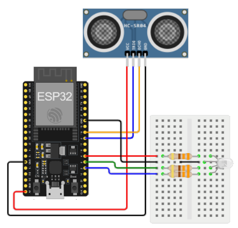

# Frameworks & plugins

## Objectives

>* Install VSCode application.
>* Install an useful VSCode plugin.
>* Perform initial tests with any ESP32 development board.

## Main references

1. Tutorial **VSCode with PlatformIO** ([link](https://randomnerdtutorials.com/vs-code-platformio-ide-esp32-esp8266-arduino)).
2. Tutorial **FreeRTOS getting started** ([link](https://randomnerdtutorials.com/esp32-freertos-arduino-tasks)).

## 1. Installation

### 1.1 VSCode installation

If you do not have VSCode in your computer, install it (Windows screenshots).


As a quick view, these are the shortcuts co access the different VSCode menus


### 1.2 Complement installation

It is possible to program the ESP32 and ESP8266 boards using VS Code with the PlatformIO IDE extension. Follow the next steps to install the PlatformIO IDE extension.

Open VS Code:

1. Click on the Extensions icon or press Ctrl+Shift+X to open the Extensions tab
2. Search for “PlatformIO IDE”
3. Select the first option
4. Finally, click the Install button (Note: the installation may take a few minutes)


After installing, make sure that PlatformIO IDE extension is enabled as shown below.


After that, the PlatformIO icon should show up on the left sidebar as well as an Home icon that redirects you to PlatformIO home.


That’s it, PlatformIO IDE extension was successfully added to VS Code.

If you don’t see the PIO icon and the quick tools at the bottom, you may need to restart VS code for the changes to take effect. Either way, we recommend restarting VS Code before proceeding.

At the bottom, there’s a blue bar with PlatformIO commands.


Here’s the what icon does from left to right:

* PlatformIO Home
* Build/Compile
* Upload
* Clean
* Serial Monitor
* New Terminal

If you hover your mouse over the icons, it will show what each icon does.

Alternatively, you can also click on the PIO icon to see all the PlatformIO tasks. 


If the tasks don’t show up on your IDE when you click the icon, you may need to click on the three dot icon at the top and enable PlatformIO tasks as shown below.


## 2. PlatformIO use

Transducers are the elements of the thing that allow the IoT device to interact with the environment. They are the equivalent of the senses in living beings and peripherals in computers.


Give your project a name (for example Blink_LED) and select the board you’re using. In our case, we’re using the DOIT ESP32 DEVKIT V1. The Framework should be “Arduino” to use the Arduino core.

You can choose the default location to save your project or a custom location.

The default location is in this path Documents >PlatformIO >Projects. For this test, you can use the default location. Finally, click “Finish”. For the **Board** use the one that you have abvailable, there are plenty of them.


The Blink_LED project should be accessible from the Explorer tab.


VS Code and PlatformIO have a folder structure that is different from the standard .ino project. If you click on the Explorer tab, you’ll see all the files it created under your project folder. It may seem a lot of files to work with. But, don’t worry, usually you’ll just need to deal with one or two of those files.

### 2.1 The .ini file

The platformio.ini file is the PlatformIO Configuration File for your project. It shows the platform, board, and framework for your project. You can also add other configurations like libraries to be included, upload options, changing the Serial Monitor baud rate and other configurations.

* **platform**: which corresponds to the SoC used by the board.
* **board**: the development board you’re using.
* **framework**: the software environment that will run the project code.
* **monitor_speed**: This is the serial communication bits rate.


With the ESP32 and ESP8266, if you want to use a baud rate of 115200 in your Serial Monitor, you just need to add the following line to your *platformio.ini* file. After that, make sure you save the changes made to the file by pressing Ctrl+S.

In this file, you can also include the identifier of libraries you’ll use in your project using the *lib_deps* directive, as we’ll see later.

## 2.2 The source code

The *src* folder is your working folder. Under the src folder, there’s a *main.cpp* file. That’s where you write your code. Click on that file. The structure of an Arduino program should open with the **setup()** and **loop()** functions. In PlatformIO, all your Arduino sketches should start with the directive

```#include <Arduino.h>```


### 2.2.1. Development boards

When working with a development system, the first thing to do is to get to know it. To do this, you need to consult the documentation it provides, such as the user manual, datasheet, examples, and pinout diagram.

The latter is extremely important because it will indicate the names, numbers, and functions of the pins that will be connected to external elements (sensors, actuators, and/or other development systems) on the development systems.

Knowing the pinouts is also important because it constitutes the starting point for configuring the ports and software modules that will be used in the IoT application in question.

Below is the pinout diagram for the Arduino UNO and the ESP32.

* **ESP32 WROOM pinout map**

  

* **One ESP32-SE DevKit-C 1 pinout map**

  

* **Arduino Nano 33 BLE Sense**
  

> **To go deeper** <br>
To go deeper, see the information related to the previous development systems at the following [link](https://udea-iot.github.io/UdeA_IoT-page/docs/sesiones/percepcion/sesion2)

## 2.3 Upload the code to the MCU

Write the "hello world" code for MCUs, with the pinout of your hardware select a pin for a work as a led driver.

```Arduino
#include <Arduino.h>

#define LED put_your_GPIO_pin_here

void setup() {
  // Runs once
  Serial.begin(115200);
  pinMode(LED, OUTPUT);
}

void loop() {
  // Runs forever
  digitalWrite(LED, HIGH);
  Serial.println("LED is on");
  delay(1000);
  digitalWrite(LED, LOW);
  Serial.println("LED is off");
  delay(1000);
}
```

Save the file, now you can click on the **Upload** icon to compile and upload the code. Alternatively, you can go to the PIO Project Tasks menu and select *Upload*.


If the code is successfully uploaded, you should get the following message.


After uploading the code, the ESP32 or ESP8266 should be blinking its on-board LED every second. If you are any of the breadboard led, you win see it blinking, if not you have to wire an external led with a 220 $\Omega$ series resistance.


Now, click on the Serial Monitor icon and you should see it printing the current LED state.


Instead, if you want to read an analog signal, follow the example avaliable [here](#444-reading-an-analog-input-link).

# 3. Installing third-party libraries on PlatformIO

Click the Home icon to go to PlatformIO Home. Click on the Libraries icon on the left side bar. Search for the library you want to install. For example *Adafruit BME280*.


Click on the library you want to include in your project. Then, click Add to Project.


Select the project were you want to use the library.


This will add the library identifier using the *lib_deps* directive on the *platformio.ini* file. If you open your project’s *platformio.ini* file, it should look as shown in the following image.


Alternatively, on the library window, if you select the Installation tab and scroll a bit, you’ll see the identifier for the library. You can choose any of those identifiers depending on the options you want to use. The library identifiers are highlighted in red.


Then, go to the *platformio.ini* file of your project and paste the library identifier into that file, like this:

```
lib_deps = adafruit/Adafruit BME280 Library@^2.1.0
```

If you need multiple libraries, you can separate their name by a coma or put them on different lines. For example:

```
lib_deps =
  arduino-libraries/Arduino_JSON @ 0.1.0
  adafruit/Adafruit BME280 Library @ ^2.1.0
  adafruit/Adafruit Unified Sensor @ ^1.1.4
```

PlatformIO has a built-in powerful Library Manager, that allows you to specify custom dependencies per project in the Project Configuration File platformio.ini using *lib_deps*. This will tell PlatformIO to automatically download the library and all its dependencies when you save the configuration file or when you compile your project.

# 4. Arduino framework utilities

# 4.1. Digital I/O

|Function|Syntax|Description|
|---|---|---|
|[`pinMode()`](https://www.arduino.cc/reference/en/language/functions/digital-io/pinmode/)|`pinMode(pin, mode)`|Configures the pin specified in the `pin` parameter as an input or output. Configuration as an input is done when the `mode` parameter is set to `INPUT`, and as an output when it is set to `OUTPUT`. When a given port has an internal pull-up resistor, it can be configured as an input by setting `mode` to `INPUT_PULLUP` |
|[`digitalWrite()`](https://www.arduino.cc/reference/en/language/functions/digital-io/digitalwrite/)|`digitalWrite(pin)`|Writes a `HIGH` or `LOW` value to the specified `pin` |
|[`digitalRead()`](https://www.arduino.cc/reference/en/language/functions/digital-io/digitalread/)|`int digitalRead(pin)`|Reads the digital value from the specified `pin`, the returned value can be `HIGH` or `LOW`|

## 4.2. Analog I/O

|Function|Syntax|Description|
|---|---|---|
|[`analogRead()`](https://www.arduino.cc/reference/en/language/functions/analog-io/analogread/)|`analogRead(pin)`|Reads the value of an analog pin. The value read depends on the resolution (number of bits) of the selected pin's analog-to-digital converter.|
|[`analogWrite()`](https://www.arduino.cc/reference/en/language/functions/analog-io/analogwrite/)|`analogWrite(pin, value)`|Writes an analog value ([PWM signal](https://docs.arduino.cc/learn/microcontrollers/analog-output/)) to the pin. The PWM signal hardness cycle value (`value`) is a value between `0` and `255`.|

## 4.3. Time

|Function|Syntax|Description|
|---|---|---|
|[`delay()`](https://www.arduino.cc/reference/en/language/functions/time/delay/)|`delay(ms)`|Pauses the program for the amount of time (in milliseconds) specified by the parameter (`ms`)|
|[`delayMicroseconds()`](https://www.arduino.cc/reference/en/language/functions/time/delaymicroseconds/)|`delayMicroseconds(us)`|Pauses the program for the amount of time (in microseconds) specified by the parameter (`us`)|
|[`millis()`](https://www.arduino.cc/reference/en/language/functions/time/millis/)|`time = millis()`|Returns the number of milliseconds that have passed since the board started executing the program.|
|[`micros()`](https://www.arduino.cc/reference/en/language/functions/time/micros/)|`time = micros()`|Gets the number of microseconds that have passed since the board started executing the program.|

## 4.4. Arduino examples

Below are some basic examples that leverage the Arduino I/O API:

### 4.4.1 Blinking an LED ([link](https://wokwi.com/projects/357845157032899585))

* **Circuit**:
  
  


* **Code**: esp32-ej1.ino
  
  ```cpp 
  void setup() {
    pinMode(LED_BUILTIN, OUTPUT);
  }
  void loop() {
    digitalWrite(LED_BUILTIN, HIGH);   
    delay(1000);                       
    digitalWrite(LED_BUILTIN, LOW);    
    delay(1000);                      
  }
  ```

<br/>

> **Note**: The detailed development of this example can be found in the following [link](ejemplos_GPIO/basic_examples/example1/)

### 4.4.2 Reading a digital signal ([link](https://wokwi.com/projects/335034266233602642))

* **Circuit**:
  
  


* **Code**: esp32-ej2.ino

    ```cpp
    #define LED_BUILTIN 2
    
    const int buttonPin = 5;         //  (GPIO5 - D5)
    const int ledPin =  LED_BUILTIN; 
    
    // variables will change:
    int buttonState = 0;         
    
    void setup() {
      pinMode(ledPin, OUTPUT);
      pinMode(buttonPin, INPUT);
    }
    
    void loop() {
      buttonState = digitalRead(buttonPin);
    
      if (buttonState == HIGH) {
        digitalWrite(ledPin, HIGH);
      } else {
        digitalWrite(ledPin, LOW);
      }
    }
    ```

<br/>

### 4.4.3 Handling a PWM signal  ([link](https://wokwi.com/projects/335030762714694227))

* **circuit**:
  
  


* **Code**: esp32-ej3.ino

    ```cpp
    int ledPin = 2;    // GPIO2
    
    void setup() {
      // nothing happens in setup
    }
    
    void loop() {
      for (int fadeValue = 0 ; fadeValue <= 255; fadeValue += 5) {
        analogWrite(ledPin, fadeValue);
        delay(30);
      }
    
      for (int fadeValue = 255 ; fadeValue >= 0; fadeValue -= 5) {
        analogWrite(ledPin, fadeValue);
        delay(30);
      }
    }
    ```

<br/>

### 4.4.4 Reading an analog input ([link](https://wokwi.com/projects/335035080677261908)).

* **Circuit**:
  
  


* **Code**: esp32-ej4.ino

    ```cpp
    const int analogInPin = 15;  //  GPIO15
    const int análogoutPin = LED_BUILTIN; // ESP32 led
    
    int sensorValue = 0;        
    int outputValue = 0;        
    
    void setup() {
      Serial.begin(9600);
    }
    
    void loop() {
      sensorValue = analogRead(analogInPin);
      outputValue = map(sensorValue, 0, 4095, 0, 255); // ADC de 12 bits
      analogWrite(análogoutPin, outputValue);
    
      Serial.print("sensor = ");
      Serial.print(sensorValue);
      Serial.print("\t output = ");
      Serial.println(outputValue);
    
      delay(2);
    }
    ```

<br/>

### 4.4.5 **Debug using the serial port** ([link](https://wokwi.com/projects/358500354708861953)).

One of the most useful applications of the serial port is that it facilitates application debugging. It allows you to print log messages at runtime, which serve to verify the correct operation of the program logic when using a program such as the serial monitor or any similar program. It is very common to print variables (which can indicate the status or value of a sensor, application messages, etc.).

* **Circuit**:
  
  


* **Code**: 

    ```cpp
    // C++ code

    /* Puertos */

    // Swichtes
    #define SW1 22
    #define SW0 23

    // Leds switches
    #define LED_SW1 21
    #define LED_SW0 19

    // Leds secuencia
    #define LED_PWM 4


    // Potenciometro
    #define POT 2

    /* Variables */
    int pot_value = 0;   // Valor del potenciometro (0 - 2013)
    int val_pwm = 0;     // Valor del pwm (0 - 255)
    int sw_val1;
    int sw_val0;
    int num_seq; 
    int loop_time = 500;

    void inicializar_entradas() {
      // Inicialice aqui las entradas
      pinMode(SW1, INPUT);
      pinMode(SW0, INPUT);
    }

    void inicializar_salidas() {
      // Inicialice aqui las salidas
      pinMode(LED_SW1, OUTPUT);
      pinMode(LED_SW0, OUTPUT);
    }

    void setup() {
      // Inicializacion de las entradas
      inicializar_entradas();
      inicializar_salidas();
      // Debug Serial
      Serial.begin(9600);
      Serial.println("Configuración de I/O -> OK");
    }

    int obtener_numero_secuencia(int sw1, int sw0) {
      // Obtiene el numero asociado a una combinación de switches
      int number;  
      if ((sw1 == LOW)&&(sw0 == LOW)) {
        number = 0;  
      }
      else if ((sw1 == LOW)&&(sw0 == HIGH)) {
        number = 1;
      }
      else if ((sw1 == HIGH)&&(sw0 == LOW)) {
        number = 2;  
      }
      else {
        number = 3;
      }
      //Serial.print("Numero:");
      //Serial.println(number, BIN);
      return number;
    }

    void encender_leds_indicadores(int number) {
      // Encendido de luces indicadores  
      switch(number) {
        case 0:
          digitalWrite(LED_SW1,LOW);
          digitalWrite(LED_SW0,LOW);
          break;
        case 1:
          digitalWrite(LED_SW1,LOW);
          digitalWrite(LED_SW0,HIGH);
          break;
        case 2:
          digitalWrite(LED_SW1,HIGH);
          digitalWrite(LED_SW0,LOW);
          break;
        default:
          digitalWrite(LED_SW1,HIGH);
          digitalWrite(LED_SW0,HIGH);
      }
    }

    void loop() {
      pot_value = analogRead(POT);
      val_pwm = map(pot_value, 0 , 4095, 0, 255);
      analogWrite(LED_PWM,val_pwm);
      Serial.print("POT: ");
      Serial.print(pot_value);  
      Serial.print("; PWM: ");
      Serial.print(val_pwm);
      // Lectura de los switches
      sw_val0 = digitalRead(SW0);  
      sw_val1 = digitalRead(SW1);
      Serial.print("- SW0: ");
      Serial.print(sw_val0);
      Serial.print("; SW1: ");
      Serial.println(sw_val1);
      // Obtencion de la secuencia
      num_seq = obtener_numero_secuencia(sw_val1, sw_val0);  
      // Encendido de los leds
      encender_leds_indicadores(num_seq); 
      delay(loop_time);
    }
    ```

### 4.4.5 RGB LED

1. Connect an RGB LED to the ESP32 and set it to light up using different colors [[[simulation]](https://wokwi.com/projects/391210532094486529) | [[solution]](ejemplos_GPIO/RGB_example/example1/README.md)].
   
   

2. Connect an RGB LED to the ESP32 and set it to light up, changing to a different color each time the user presses a button. [[[simulation]](https://wokwi.com/projects/391344633629636609) | [[solution]](ejemplos_GPIO/RGB_example/example2/README.md)].
   
   

### 4.4.6  Examples using a PIR sensor

1. Activate an LED when presence is detected using a PIR sensor
  [[[simulation]](https://wokwi.com/projects/391364172928279553) | [[solution]](https://github.com/UdeA-IoT/clases-IoT_2024-2/blob/main/clase4/ejemplos_GPIO/PIR_example/example1/README.md)]
   
   

2. Activate an LED when a presence is detected using a PIR sensor. In addition to the light signal used to indicate presence, the system will have a buzzer to generate an audible alarm. This audible alarm can be deactivated or activated using a push button.
 [[[simulation]](https://wokwi.com/projects/391364988125921281) | [[solution]](https://github.com/UdeA-IoT/clases-IoT_2024-2/blob/main/clase4/ejemplos_GPIO/PIR_example/example2/README.md)]
   
   

### 4.4.7. Ultrasonic sensor

1. This example was adapted from **SparkFun Inventor's Kit Experiment Guide - Project 3: Motion** ([link](https://learn.sparkfun.com/tutorials/sparkfun-inventors-kit-experiment-guide---v40/project-3-motion)) for ESP32
 [[[simulation]](https://wokwi.com/projects/391349504507707393) | [[solution]](https://github.com/UdeA-IoT/clases-IoT_2024-2/blob/main/clase4/ejemplos_GPIO/ultrasonic-sensor_example/example1/README.md)]. 
   
  
2. The following example shows, using the serial monitor, the distance in centimeters and inches, which was implemented in the previous example with an LED that changes color as the distance measured by the ultrasonic sensor changes.
 [[[simulation]](https://wokwi.com/projects/391350736522728449) | [[solution]](https://github.com/UdeA-IoT/clases-IoT_2024-2/blob/main/clase4/ejemplos_GPIO/ultrasonic-sensor_example/example2/README.md)]
    

### 4.4.7. Potentiometer

Below is a circuit that allows you to vary the intensity of an LED using a potentiometer connected to an Arduino.

The component list is shown in the following BOM:


|Item #|Quantity|Reference|Description|
|---|---|---|---|
|1|1|LED1|Arduino Uno R3|
|2|1|R1|Potenciometro de $10k\Omega$|
|3|1|R2|Resistencia de $270\Omega$|


The schematic is shown below:


Perform the following tasks:
1. The program downloaded to the Arduino UNO is shown below:
   
   ```c++
   const int voltsInPin = A3;
   const int ledPin = 9;

   void setup() {
     pinMode(ledPin, OUTPUT);
   }
   void loop() {
     int rawReading = analogRead(voltsInPin);
     int period = map(rawReading, 0, 1023, 100, 500);
     digitalWrite(ledPin, HIGH);
     delay(period);
     digitalWrite(ledPin, LOW);
     delay(period);
   }
   ```

2. Using [wokwi](https://wokwi.com/), create the setup, write the simulation code, and run the simulation. Then, publish the simulation link to share your work with the community.

### 4.4.8. Tone generator

The following system shows a simple tone generator. The list of components is shown below:

|Item #|Quantity|Reference|Description|
|---|---|---|---|
|1|1|LED1|Arduino Uno R3|
|2|2|S1, S2|Push button|
|3|1|Sounder|Passive buzzer|

The schematic is shown below:


Perform the following tasks:
1. Create the assembly in Fritzing and save it as **sounds.fzz**. Then, generate the images associated with the schematic and the assembly.
2. The program downloaded to the Arduino UNO is shown below:
   ```c++
   const int sw1pin = 6;
   const int sw2pin = 7;
   const int soundPin = 8;

   void setup() {
     pinMode(sw1pin, INPUT_PULLUP);
     pinMode(sw2pin, INPUT_PULLUP);
     pinMode(soundPin, OUTPUT);
   }
   void loop() {
     if (!digitalRead(sw1pin)) {
       tone(soundPin, 220);
     }
     else if (!digitalRead(sw2pin)) {
       tone(soundPin, 300);
     }
     else {
       noTone(soundPin);
     }
   }
   ```

3. Using [wokwi](https://wokwi.com/), create the setup, write the simulation code, and run the simulation. Then, publish the simulation link to share your work with the community.

> **To go deeper**: To see more things that can be done with the ESP32 you can consult the link within the **randomnerdtutorials** page **160+ ESP32 Projects, Tutorials and Guides with Arduino IDE** ([link](https://randomnerdtutorials.com/projects-esp32/))

# 4. Wrapping up

In this tutorial you’ve learned how to install and prepare Visual Studio Code to work with the ESP32 and ESP8266 boards. VS Code with the PlatformIO IDE extension is a great alternative to the classical Arduino IDE, especially when you’re working on more advanced sketches for larger applications.

We have shown some examples to test in simulation and implementation.