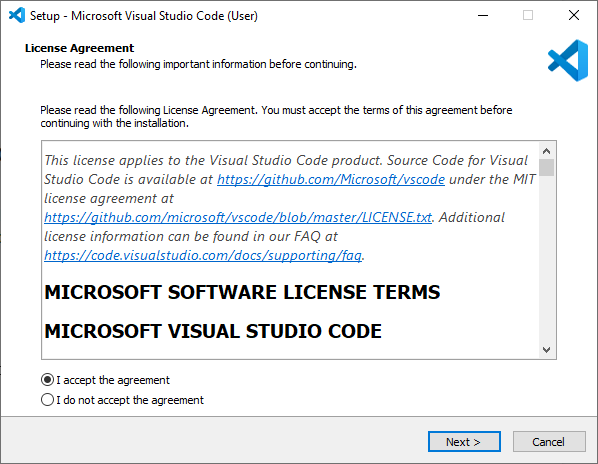

# Frameworks & RTOS

## Objectives

>* Install an useful VSCode plugin.
>* Perform initial tests with the ESP32 development board
>* Use an embedded RTOS in the MCU.

## Main references

1. Tutorial **VSCode with PlatformIO** ([link](https://randomnerdtutorials.com/vs-code-platformio-ide-esp32-esp8266-arduino)).
2. Tutorial **FreeRTOS getting started** ([link](https://randomnerdtutorials.com/esp32-freertos-arduino-tasks)).

## 1. Installation

### 1.1 VSCode installation

If you do not have VSCode in your computer, install it (Windows screenshots).





As a quick view, these are the shortcuts co access the different VSCode menus


### 1.2 Complement installation

It is possible to program the ESP32 and ESP8266 boards using VS Code with the PlatformIO IDE extension. Follow the next steps to install the PlatformIO IDE extension.

Open VS Code:

1. Click on the Extensions icon or press Ctrl+Shift+X to open the Extensions tab
2. Search for “PlatformIO IDE”
3. Select the first option
4. Finally, click the Install button (Note: the installation may take a few minutes)


After installing, make sure that PlatformIO IDE extension is enabled as shown below.


After that, the PlatformIO icon should show up on the left sidebar as well as an Home icon that redirects you to PlatformIO home.


That’s it, PlatformIO IDE extension was successfully added to VS Code.

If you don’t see the PIO icon and the quick tools at the bottom, you may need to restart VS code for the changes to take effect. Either way, we recommend restarting VS Code before proceeding.

At the bottom, there’s a blue bar with PlatformIO commands.


Here’s the what icon does from left to right:

* PlatformIO Home
* Build/Compile
* Upload
* Clean
* Serial Monitor
* New Terminal

If you hover your mouse over the icons, it will show what each icon does.

Alternatively, you can also click on the PIO icon to see all the PlatformIO tasks. 


If the tasks don’t show up on your IDE when you click the icon, you may need to click on the three dot icon at the top and enable PlatformIO tasks as shown below.


## 2. PlatformIO use

Transducers are the elements of the thing that allow the IoT device to interact with the environment. They are the equivalent of the senses in living beings and peripherals in computers.


Give your project a name (for example Blink_LED) and select the board you’re using. In our case, we’re using the DOIT ESP32 DEVKIT V1. The Framework should be “Arduino” to use the Arduino core.

You can choose the default location to save your project or a custom location.

The default location is in this path Documents >PlatformIO >Projects. For this test, you can use the default location. Finally, click “Finish”. For the **Board** use the one that you have abvailable, there are plenty of them.


The Blink_LED project should be accessible from the Explorer tab.


VS Code and PlatformIO have a folder structure that is different from the standard .ino project. If you click on the Explorer tab, you’ll see all the files it created under your project folder. It may seem a lot of files to work with. But, don’t worry, usually you’ll just need to deal with one or two of those files.

### 2.1 The .ini file

The platformio.ini file is the PlatformIO Configuration File for your project. It shows the platform, board, and framework for your project. You can also add other configurations like libraries to be included, upload options, changing the Serial Monitor baud rate and other configurations.

* **platform**: which corresponds to the SoC used by the board.
* **board**: the development board you’re using.
* **framework**: the software environment that will run the project code.
* **monitor_speed**: This is the serial communication bits rate.


With the ESP32 and ESP8266, if you want to use a baud rate of 115200 in your Serial Monitor, you just need to add the following line to your *platformio.ini* file. After that, make sure you save the changes made to the file by pressing Ctrl+S.

In this file, you can also include the identifier of libraries you’ll use in your project using the *lib_deps* directive, as we’ll see later.

## 2.2 The source code

The *src* folder is your working folder. Under the src folder, there’s a *main.cpp* file. That’s where you write your code. Click on that file. The structure of an Arduino program should open with the **setup()** and **loop()** functions. In PlatformIO, all your Arduino sketches should start with the directive

```#include <Arduino.h>```


## 2.3 Upload the code to the MCU

```Arduino
#include <Arduino.h>

#define LED put_your_GPIO_pin_here

void setup() {
  // Runs once
  Serial.begin(115200);
  pinMode(LED, OUTPUT);
}

void loop() {
  // Runs forever
  digitalWrite(LED, HIGH);
  Serial.println("LED is on");
  delay(1000);
  digitalWrite(LED, LOW);
  Serial.println("LED is off");
  delay(1000);
}
```

Save the file, now you can click on the **Upload** icon to compile and upload the code. Alternatively, you can go to the PIO Project Tasks menu and select *Upload*.


If the code is successfully uploaded, you should get the following message.


After uploading the code, the ESP32 or ESP8266 should be blinking its on-board LED every second. If you are any of the breadboard led, you win see it blinking, if not you have to wire an external led with a 220 $\Omega$ series resistance.


Now, click on the Serial Monitor icon and you should see it printing the current LED state.


# 3. Installing third-party libraries on PlatformIO

Click the Home icon to go to PlatformIO Home. Click on the Libraries icon on the left side bar. Search for the library you want to install. For example *Adafruit BME280*.


Click on the library you want to include in your project. Then, click Add to Project.


Select the project were you want to use the library.


This will add the library identifier using the *lib_deps* directive on the *platformio.ini* file. If you open your project’s *platformio.ini* file, it should look as shown in the following image.


Alternatively, on the library window, if you select the Installation tab and scroll a bit, you’ll see the identifier for the library. You can choose any of those identifiers depending on the options you want to use. The library identifiers are highlighted in red.


Then, go to the *platformio.ini* file of your project and paste the library identifier into that file, like this:

```
lib_deps = adafruit/Adafruit BME280 Library@^2.1.0
```

If you need multiple libraries, you can separate their name by a coma or put them on different lines. For example:

```
lib_deps =
  arduino-libraries/Arduino_JSON @ 0.1.0
  adafruit/Adafruit BME280 Library @ ^2.1.0
  adafruit/Adafruit Unified Sensor @ ^1.1.4
```

PlatformIO has a built-in powerful Library Manager, that allows you to specify custom dependencies per project in the Project Configuration File platformio.ini using *lib_deps*. This will tell PlatformIO to automatically download the library and all its dependencies when you save the configuration file or when you compile your project.

# 4. Wrapping up

In this tutorial you’ve learned how to install and prepare Visual Studio Code to work with the ESP32 and ESP8266 boards. VS Code with the PlatformIO IDE extension is a great alternative to the classical Arduino IDE, especially when you’re working on more advanced sketches for larger applications.