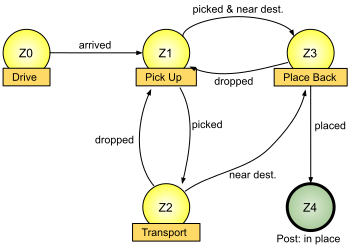
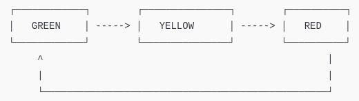
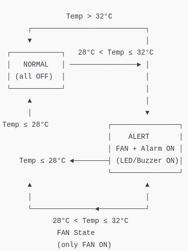

# A review of firmware development

## Objectives

>* Getting close to some alternatives to develop firmware for MCUs
>* Apply some of this strategies in a simple example. 
>* Keep going with the relationship with the embedded plattform.

## State Machines

A state machine or *Finite State Machine (FSM)* can be defined as:

> **Finite State Machine**:
> *It's a computational abstraction. A model of the behavior of an automatic machine. This model uses States, Transitions, Inputs and Outputs.*

They are widely used in the development of small/medium complexity applications. For example, the image shows a FSM example for cleaning up items in a household.



FSMs start a well knew point and, while inputs (or conditions) are changing, the FSM decides wich state is the next to be executed (transitions).

### Example # 1

Let's make a simple semaphore controller using FSM methodology, the state diagrams looks like this:



The code should look similar to this:

```cpp
#include <Arduino.h>

// Pins for leds and button
#define L_G  26
#define L_Y  27
#define L_R  25
#define BUT  14

// States of the FSM
#define ST_GREEN  0
#define ST_YELLOW 1
#define ST_RED    2

int curr_state = ST_GREEN;

// State times
unsigned long tbefore = 0;
const unsigned long green_interval = 5000;    // 5s
const unsigned long yellow_interval = 2000; // 2s
const unsigned long red_interval = 5000;     // 5s

// Function to manage FSM
void fsm_process();

void setup()
{
    pinMode(L_G, OUTPUT);
    pinMode(L_Y, OUTPUT);
    pinMode(L_R, OUTPUT);
    pinMode(BUT, INPUT_PULLUP);
    Serial.begin(115200);
}

void loop()
{
    fsm_process();
}

void fsm_process()
{
  unsigned long tnow = millis();

  switch (curr_state)
  {
    case ST_GREEN:
        digitalWrite(L_G, 1);
        digitalWrite(L_Y, 0);
        digitalWrite(L_R, 0);

        if (tnow - tbefore >= green_interval && digitalRead(BUT) == 1) {
          curr_state = ST_YELLOW;
          tbefore = tnow;
          Serial.println("Changed to YELLOW!");
        }
        break;

    case ST_YELLOW:
        digitalWrite(L_G, 0);
        digitalWrite(L_Y, 1);
        digitalWrite(L_R, 0);

        if (tnow - tbefore >= yellow_interval) {
          curr_state = ST_RED;
          tbefore = tnow;
          Serial.println("Changed to RED!");
        }
        break;

    case ST_RED:
        digitalWrite(L_G, 0);
        digitalWrite(L_Y, 0);
        digitalWrite(L_R, 1);

        if (tnow - tbefore >= red_interval) {
          curr_state = ST_GREEN;
          tbefore = tnow;
          Serial.println("Changed to GREEN!");
        }
        break;
    default: // Green
        digitalWrite(L_G, 1);
        digitalWrite(L_Y, 0);
        digitalWrite(L_R, 0);

        if (tnow - tbefore >= green_interval && digitalRead(BUT) == 1) {
          curr_state = ST_YELLOW;
          tbefore = tnow;
          Serial.println("Changed to YELLOW!");
        }
        break;
  }
}
```
### Example # 2

Let's read a DTH11 sensor, available in the kit provided in the laboratory. Lets implement this FSM (**remember to include DHT11 library, as we saw in the last session**):



The code should be similar to this one:

```cpp
#include <Arduino.h>
#include "DHT.h"

// --- Pines ---
#define DHTPIN  4        // DHT11 pin
#define DHTTYPE DHT11
#define FAN_PIN  26      // Fan (ej. relay or transistor)
#define ALERT_PIN 27    // Alarm (LED or buzzer)

// --- DHT config ---
DHT dht(DHTPIN, DHTTYPE);

// --- FSM STATES ---
#define NORMAL_MODE   0
#define FAN_MODE      1
#define ALERT_MODE    2
int curr_state = NORMAL_MODE;

// --- Variables de tiempo ---
unsigned long tbefore = 0;
const unsigned long read_interval = 2000; // Read every 2 seconds

void fsm_process();

void setup()
{
  Serial.begin(115200);
  dht.begin();

  pinMode(FAN_PIN, OUTPUT);
  pinMode(ALERT_PIN, OUTPUT);

  digitalWrite(FAN_PIN, LOW);
  digitalWrite(ALERT_PIN, LOW);

  Serial.println("FSM control with DHT11 starting...");
}

void loop()
{
  fsm_process();
}

void fsm_process()
{
    unsigned long tnow = millis();

  // Read every 2 seconds
  if (tnow - tbefore >= read_interval) {
    tbefore = tnow;

    float t = dht.readTemperature();
    float h = dht.readHumidity();

    if (isnan(t) || isnan(h)) {
      Serial.println("Error reading DHT11 sensor");
      return;
    }

    Serial.print("Temp: ");
    Serial.print(t);
    Serial.print(" °C  Humidity: ");
    Serial.print(h);
    Serial.println(" %");

    // FSM: State transtions
    switch (curr_state) {
      case NORMAL_MODE:
        digitalWrite(FAN_PIN, LOW);
        digitalWrite(ALERT_PIN, LOW);

        if (t > 28 && t <= 32) {
          curr_state = FAN_MODE;
          Serial.println(">> Transition to FAN mode");
        } else if (t > 32) {
          curr_state = ALERT_MODE;
          Serial.println(">> Transition to ALERT mode");
        }
        break;

      case FAN_MODE:
        digitalWrite(FAN_PIN, HIGH);
        digitalWrite(ALERT_PIN, LOW);

        if (t <= 28) {
          curr_state = NORMAL_MODE;
          Serial.println(">> Transition to NORMAL mode");
        } else if (t > 32) {
          curr_state = ALERT_MODE;
          Serial.println(">> Transition to ALERT mode");
        }
        break;

      case ALERT_MODE:
        digitalWrite(FAN_PIN, HIGH);
        digitalWrite(ALERT_PIN, HIGH);

        if (t <= 28) {
          curr_state = NORMAL_MODE;
          Serial.println(">> Transition to NORMAL mode");
        } else if (t > 28 && t <= 32) {
          curr_state = FAN_MODE;
          Serial.println(">> Transition to FAN mode");
        }
        break;
    }
  }
}
```

## Embedded Operating System

An *Embedded Operating System (EOS)* is a piece of firmware useful to manage multiple tasks inside a microcontroller. Some of the most used EOS's are: 
- [Embedded linux](https://www.google.com/url?sa=t&rct=j&q=&esrc=s&source=web&cd=&cad=rja&uact=8&ved=2ahUKEwja64uPocKPAxWeSzABHRCOG-sQFnoECAwQAQ&url=https%3A%2F%2Fwww.arm.com%2Fresources%2Feducation%2Fonline-courses%2Fembedded-linux&usg=AOvVaw0o9L11pSUVm5cFFEAZZ3ng&opi=89978449)
- [TinyOS](https://www.google.com/url?sa=t&rct=j&q=&esrc=s&source=web&cd=&cad=rja&uact=8&ved=2ahUKEwjNjt3uoMKPAxWTSjABHTarLvAQFnoECCgQAQ&url=https%3A%2F%2Fgithub.com%2Ftinyos&usg=AOvVaw28C92S_yasJxnNMxhHUjJM&opi=89978449)
- [ThreadX](https://www.google.com/url?sa=t&rct=j&q=&esrc=s&source=web&cd=&cad=rja&uact=8&ved=2ahUKEwivrZHfoMKPAxVYSjABHSCRATwQFnoECDYQAQ&url=https%3A%2F%2Fgithub.com%2Feclipse-threadx%2Fthreadx&usg=AOvVaw2Lk97SKKqllfcy7OvC0wMy&opi=89978449)
- [mbedOS](https://www.google.com/url?sa=t&rct=j&q=&esrc=s&source=web&cd=&cad=rja&uact=8&ved=2ahUKEwj3hd-moMKPAxX2SjABHQkOBLcQFnoECA4QAQ&url=https%3A%2F%2Fos.mbed.com%2Fmbed-os%2F&usg=AOvVaw0n_npwa0c01oi9DZD7Le_-&opi=89978449)
- [Free Real-Time OS](https://www.google.com/url?sa=t&rct=j&q=&esrc=s&source=web&cd=&cad=rja&uact=8&ved=2ahUKEwivqaaiocKPAxULSTABHbmLM9wQFnoECBYQAQ&url=https%3A%2F%2Fwww.freertos.org%2F&usg=AOvVaw1rceblHUTFrkSo3at3b_bR&opi=89978449)

We are going to explore a little bit of FreeRTOS, because is free, open and has been ported to a lot of plattforms (ESP32 included).

### FreeRTOS and ESP32

The FreeRTOS real-time operating system is built into the ESP32 and integrated into the Espressif IDF and the Arduino core. It supports:

- **Task Management**: Create, suspend, resume, or delete tasks (covered in this tutorial).
- **Scheduling**: Allows you to give priority to your tasks, so they run in a specific order (covered in this tutorial).
- **Inter-Task Communication**: Using things like queues, semaphores, and mutexes, we can ensure seamless communication between tasks without crashing the ESP32.
- **Dual-Core Support**: It allows you to run your tasks on either core 0 or core 1 of the ESP32.

### Basic concepts

- **Tasks**: Tasks are independent functions running concurrently, each with its own stack (memory usage allocated) and priority. Tasks can be in states like Running, Ready, Blocked, or Suspended.
- **Scheduler**: The scheduler decides which tasks to run based on their priorities. This is a preemptive scheduler, which means it can interrupt a lower-priority task at any time to run a higher-priority one, ensuring that critical tasks are executed as soon as they’re ready.
- **Priorities**: Higher numbers indicate higher priority (for example: 1 = low, 5 = high).

### FreeRTOS example # 1

This example uses 2 leds to blink them at different rates. **How would you do this application in the normal way?**

```cpp
#include <Arduino.h>

#define LED_PIN 2
#define RTOS_delay(x) vTaskDelay(x / portTICK_PERIOD_MS)

// Declare task handle
TaskHandle_t BlinkTaskHandle = NULL;

void BlinkTask(void *parameter)
{
  for (;;) // Infinite loop
  {
    digitalWrite(LED_PIN, HIGH);
    Serial.println("BlinkTask: LED ON");
    RTOS_delay(1000);
    digitalWrite(LED_PIN, LOW);
    Serial.println("BlinkTask: LED OFF");
    RTOS_delay(1000);
    Serial.print("BlinkTask running on core ");
    Serial.println(xPortGetCoreID());
  }
}

void setup() {
  Serial.begin(115200);
  
  pinMode(LED_PIN, OUTPUT);

  xTaskCreatePinnedToCore(
    BlinkTask,         // Task function
    "BlinkTask",       // Task name
    10000,             // Stack size (bytes)
    NULL,              // Parameters
    1,                 // Priority
    &BlinkTaskHandle,  // Task handle
    1                  // Core 1
  );
}

void loop() {
  // Empty because FreeRTOS scheduler runs the task
}
```

## Suspending and resuming tasks

Task can wait for other tasks or routines in the microcontroller.

### FreeRTOS example # 2

The following code listens to the press of a pushbutton to either suspend or resume the blinking FreeRTOS task.

```cpp
#include <Arduino.h>

#define LED1_PIN 2
#define BUTTON_PIN 23
#define RTOS_delay(x) vTaskDelay(x / portTICK_PERIOD_MS)

// Task handle
TaskHandle_t BlinkTaskHandle = NULL;

// Volatile variables for ISR
volatile bool taskSuspended = false;
volatile uint32_t lastInterruptTime = 0;
const uint32_t debounceDelay = 100; // debounce period

void IRAM_ATTR buttonISR() {
  // Debounce
  uint32_t currentTime = millis();
  if (currentTime - lastInterruptTime < debounceDelay) {
    return;
  }
  lastInterruptTime = currentTime;

  // Toggle task state
  taskSuspended = !taskSuspended;
  if (taskSuspended) {
    vTaskSuspend(BlinkTaskHandle);
    Serial.println("BlinkTask Suspended");
  } else {
    vTaskResume(BlinkTaskHandle);
    Serial.println("BlinkTask Resumed");
  }
}

void BlinkTask(void *parameter)
{
   // Initialize pins
  pinMode(LED1_PIN, OUTPUT);
  pinMode(BUTTON_PIN, INPUT_PULLUP); // Internal pull-up resistor
  // Attach interrupt to button
  attachInterrupt(digitalPinToInterrupt(BUTTON_PIN), buttonISR, FALLING);
  for (;;) // Infinite loop
  {
    digitalWrite(LED1_PIN, HIGH);
    Serial.println("BlinkTask: LED ON");
    RTOS_delay(1000);
    digitalWrite(LED1_PIN, LOW);
    Serial.println("BlinkTask: LED OFF");
    Serial.print("BlinkTask running on core ");
    Serial.println(xPortGetCoreID());
    RTOS_delay(1000);
  }
}

void setup()
{
  Serial.begin(115200);
  // Create task
  xTaskCreatePinnedToCore(
    BlinkTask,         // Task function
    "BlinkTask",       // Task name
    10000,             // Stack size (bytes)
    NULL,              // Parameters
    1,                 // Priority
    &BlinkTaskHandle,  // Task handle
    1                  // Core 1
  );
}

void loop()
{
  // Empty because FreeRTOS scheduler runs the task
}
```

### Multitasking

Multitasking refers to the capacity of the MCU to attend different applications "at the same time", as we usually do in when we use a computer.

A FreeRTOS task is contained inside a function thta has a *setup()* and *loop()* stages. FreeRTOS mission is to execute all tasks in a way they allow the execution of other tasks.

## References

1. FreeRTOS tutorial  ([link](https://randomnerdtutorials.com/esp32-freertos-arduino-tasks)).