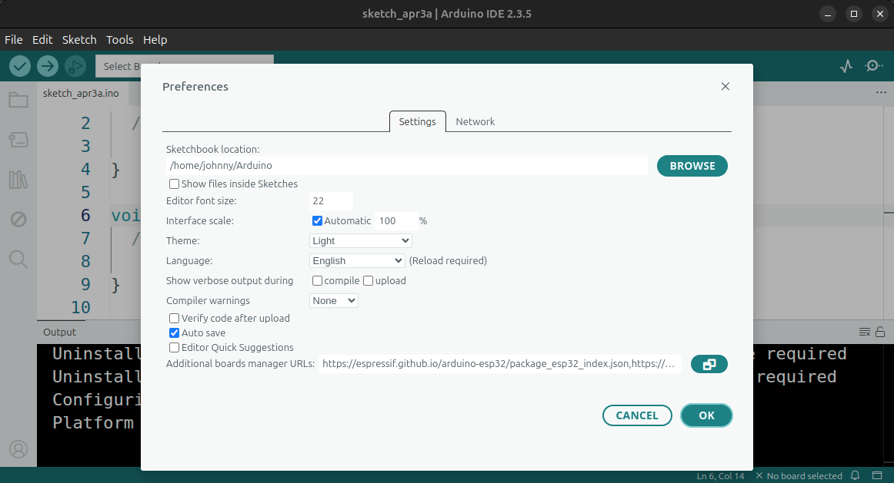
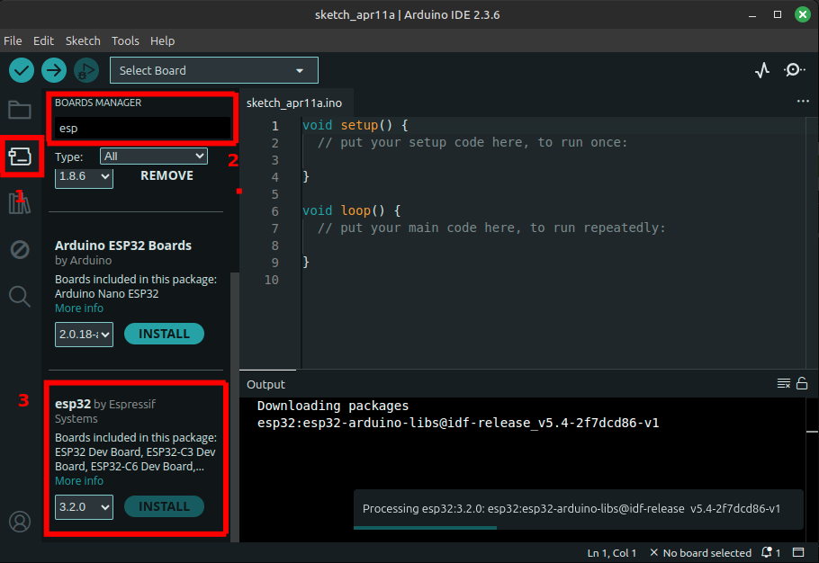
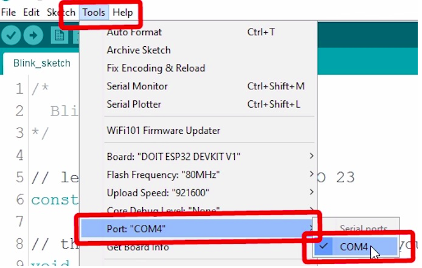
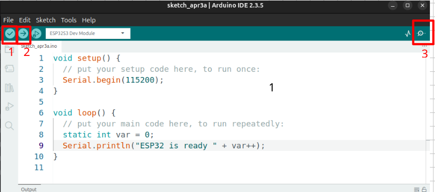

# Basic Components of an IoT System

## Objectives

>* Make the first tests with the ESP32 development board
>* Use simple circuits and programs with an online simulator for the platform

## Main References

1. Lesson 2 **A deeper dive into IoT** ([link](https://github.com/microsoft/IoT-For-Beginners/blob/main/1-getting-started/lessons/2-deeper-dive/README.md)) from Microsoft’s **IoT for Beginners** course [[link](https://github.com/microsoft/IoT-For-Beginners)]
2. Lesson 3 **Interact with the physical world** ([link](https://github.com/microsoft/IoT-For-Beginners/blob/main/1-getting-started/lessons/3-sensors-and-actuators/README.md)) from Microsoft’s **IoT for Beginners** ([link](https://github.com/microsoft/IoT-For-Beginners)) by Microsoft.

## Online Simulators

The following is a list of applications that will be used for simulation purposes. To use them you only need, for example, a Google email account:
- [x] Tinkercad (https://www.tinkercad.com/)
- [x] Wokwi (https://wokwi.com/)

## Classroom Work

## 1. Development Systems

The heart of IoT systems is the “things.” They are responsible for enabling the system’s interaction with the environment by collecting and processing data and performing control actions over it.

To carry out prototyping tasks, development systems (dev kits) are used, which are of two types, *Microcontrollers* and *Single-Board Computers*, as shown in the following figure:


### Systems available in the laboratory

Below is a list of some development systems. Those available in the laboratory are marked.

#### Microcontrollers

- [x] Arduino UNO
- [x] ESP32
- [x] ARDUINO NANO 33 BLE Sense Lite
- [x] ESP8266 (Actually a little bit old)

#### Single-board computers

- [x]  Raspberry Pi [[link]](https://www.raspberrypi.com/)
- [ ]  BeagleBoard [[link]](https://www.beagleboard.org/)
- [ ]  Orange Pi [[link]](http://www.orangepi.org/)
- [ ]  Banana Pi[[link]](https://www.banana-pi.org/)
- [ ]  Intel Galileo [[link]](https://ark.intel.com/content/www/us/en/ark/products/78919/intel-galileo-board.html)

> **To go deeper** <br>
> To learn more about these elements available in the laboratory, check the following [link](https://udea-iot.github.io/UdeA_IoT-page/docs/sesiones/percepcion/sesion2)

## 2. Development environment configuration for microcontrollers

### Arduino framework

To program a microcontroller, you need some tools to develop the software that will run on the microcontroller (firmware). Due to the large number of existing microcontrollers, each manufacturer offers a framework to facilitate the development of applications for any microcontroller compatible with them.

Due to its popularity and ease of use, this course will use the Arduino Framework. Arduino is an open-source electronics platform that combines hardware and software, making it ideal for programming not only Arduino boards but also boards from other manufacturers using the programming model employed in Arduino to develop software.

In this model, boards are programmed in C or C++ through a code file known as a **sketch** ([link](https://github.com/microsoft/IoT-For-Beginners/blob/main/1-getting-started/lessons/2-deeper-dive/README.md)):


The **sketch** consists of two main functions (see figure taken from the following [link](https://github.com/microsoft/IoT-For-Beginners/blob/main/1-getting-started/lessons/2-deeper-dive/README.md)):
* **`setup`**: Initialization code (port initialization, Wi-Fi connection, cloud services, etc.) that runs one time when the microcontroller is powered on.
* **`loop`**: Code that runs continuously (forever loop) while the microcontroller is on. This is where the application logic is implemented (reading sensors, controlling actuators, sending and receiving information, etc.).

Below is a typical code template:

```cpp
// Project Name
// Description: Brief description of the project and its functionality

// Include necessary libraries
#include <Arduino.h>


// Define constants and pin assignments


// Global variables

void setup() {
    // Initial setup
    // code...
}

void loop() {
    // Code that runs repeatedly
    // code...
   
}
```

To develop applications on devices compatible with the Arduino framework, there are several development environments (IDEs), among which Arduino IDE and Visual Studio Code stand out, the latter used together with the PlatformIO extension, which enables the development of applications on microcontrollers.

### Development environment setup

Throughout the course we will use Visual Studio Code with PlatformIO, so the first step is to install and configure the tool. See the page **Getting Started with VS Code and PlatformIO IDE for ESP32 and ESP8266 (Windows, Mac OS X, Linux Ubuntu)** ([link](https://randomnerdtutorials.com/vs-code-platformio-ide-esp32-esp8266-arduino/)) from the **Random Nerd Tutorials** site ([link](https://randomnerdtutorials.com/)).

Before getting started, have a pinout diagram for the ESP32 at hand as shown below:


Likewise, keep the following resources on hand for quick reference:
- [x] Arduino cheat sheet ([link](https://www.cheat-sheets.org/saved-copy/Arduino-cheat-sheet-v02c.pdf))
- [X] Arduino Language Reference ([link](https://www.arduino.cc/reference/en/))
  
  

To set up the following examples follow the steps described on the page **First steps with PlatformIO** ([link](./plaftormio_tutorial))

### Arduino IDE configuration

1. Go to this [link](https://www.arduino.cc/en/software) download and install the software. 

2. Once installed go to File -> Preferences -> Manage Additional Cards and insert this link into the box.

[https://espressif.github.io/arduino-esp32/package_esp32_index.json](https://espressif.github.io/arduino-esp32/package_esp32_index.json)

This step is necessary for the IDE to recognize the cards developed for the ESP32.



3. Install the ESP32 boards in the Arduino IDE. 1. Select boards, 2. Search for "esp", 3. Install them.

 

4. In the Arduino IDE, find the appropriate board for your microcontroller using the menu:

Tools -> Cards -> ESP32

5. Connect the microcontroller to the computer, the computer should recognize this micro as a COMxx port (in Windows) or a /dev/ttySxx port (in Linux)

6. In the Arduino IDE, find the appropriate board for your microcontroller using the menu:

Tools -> Port -> \[Choose your port here\]



6. Insert the code from the image, compile the code (1) download the program to the microcontroller (2) and open the serial monitor (3)



### Application examples

#### Example 1

**Description**: The following application shows turning an LED on and off at a frequency of 1Hz.

**Components**:

| Item No. | Component Name| Quantity |
|---|---|---|
|1|ESP32 Development Board|1|
|2|LED (Red)|1|
|3|220Ω Resistor|1|

**Schematic**:


**Wiring Diagram**:


**Code**:

```cpp
// ESP32-blink
// Description: Program that turns an LED on and off connected to GPIO2 
// at a frequency of 1Hz

// Include necessary libraries
#include <Arduino.h>

// Define constants and pin assignments
#define LED_PIN 2          // P2 (GPIO2)

// Global variables
int delay_ms = 500;

void setup() {
    // Initial setup
    // Port configure
    pinMode(LED_PIN, OUTPUT);    
    digitalWrite(LED_PIN, LOW);
}

void loop() {
    delay(delay_ms);             // Delay 500ms
    digitalWrite(LED_PIN, HIGH); // LED ON
    delay(delay_ms);             // Delay 500ms 
    digitalWrite(LED_PIN, LOW);  // LED OFF
}
```

**Simulation**: The simulation is shown at the following [link](https://wokwi.com/projects/406255037756300289)


#### Example 2

**Description**: Modify the previous example so that turning the LED on and off depends on the following commands sent via serial.

|Command|Description|
|---|---|
|H| Command used to turn the LED ON.|
|L| Command used to turn the LED OFF.|


**Components**:

| Item No. | Component Name| Quantity |
|---|---|---|
|1|ESP32 Development Board|1|
|2|LED (Red)|1|
|3|220Ω Resistor|1|

**Schematic**:


**Wiring Diagram**:


**Code**:

```cpp
// ESP32-ledSerial
// Description: Program that turns an LED on and off using serial commands.

// Include necessary libraries
#include <Arduino.h>
/* Inputs and outputs */
#define LIGHT1 16          // P26 (GPIO26)

/* Commands */
#define LIGHT_ON 'H'       // Light ON  
#define LIGHT_OFF 'L'      // Light OFF  

int cmd = 0; // Command read from serial

void setup() {
  // Digital ports configuration
  pinMode(LIGHT1, OUTPUT);    
  digitalWrite(LIGHT1, LOW);
  // Serial port configuration
  Serial.begin(9600); 
  Serial.println("System ready to receive commands (H: ON - L: OFF)");  
  
}

void loop() {
  // reply only when you receive data:
  if (Serial.available() > 0) {
    // read the incoming byte:
    cmd = Serial.read();

    // Turn the light on or off according to the command
    if(cmd == LIGHT_ON) {
      digitalWrite(LIGHT1, HIGH);
      Serial.println("Light -> ON");
    }
    else if(cmd == LIGHT_OFF) {
      digitalWrite(LIGHT1, LOW);    
      Serial.println("Light -> OFF");
    } 
  }
}
```

**Simulation**: The simulation is shown at the following [link](https://wokwi.com/projects/406259527261320193)


## References

* https://how2electronics.com/10-essential-iot-starter-kits-to-kickstart-your-journey/
* https://udea-iot.github.io/UdeA_IoT-page/docs/sensores-actuadores/sensores/intro
* https://gist.github.com/lyqht
* https://github.com/microsoft/IoT-For-Beginners
* https://github.com/microsoft/ML-For-Beginners
* https://github.com/microsoft/Web-Dev-For-Beginners
* https://github.com/microsoft/ai-for-beginners
* https://github.com/microsoft/Data-Science-For-Beginners

